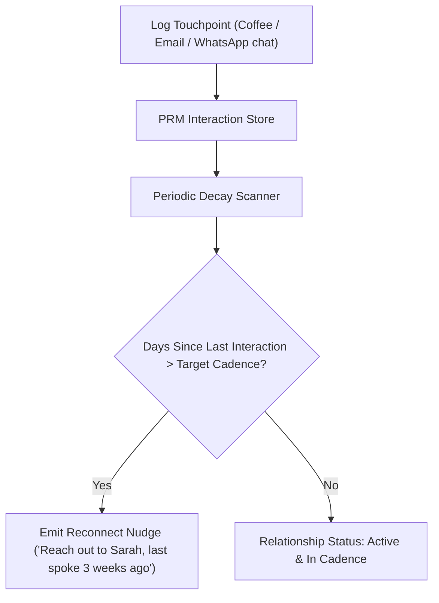

# genpark-personal-relationship-network-graph-skill

> Personal Relationship Management (PRM) & Decay Engine. 100% Python Standard Library.

Distilled from **Folk**, helping individuals and founders manage relationship health, maintain periodic reconnect cadences, and surface ambient context before upcoming interactions.

## Architecture

## Features
- **Cadence Drift Detection**: Automatically identifies contacts you are falling out of touch with.
- **Context Preservation**: Retains lightweight discussion points and notes per relationship node.
